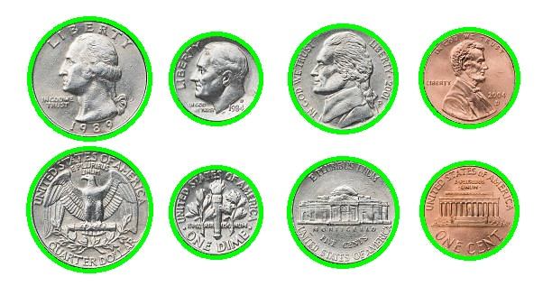

# VR Assignment

## Requirements
- Python 3.x
- OpenCV (`pip3 install opencv-python`)
- NumPy (`pip3 install numpy`)
- Matplotlib (`pip3 install matplotlib`)

## Coin Detection
1. Place coin image as `coins.jpg` in the root directory.
2. Run `python3 1a_Detect_Coins.py`.
3. Outputs:
   - `detected_coins.jpg`: Original image with detected circles.

## Panorama Stitching
1. Place overlapping images in `panorama_images` directory.
2. Run `python3 2a.py`.
3. Output: `stitched_result.jpg`.

## Results
- Coin detection example:
  
- Panorama example:
  